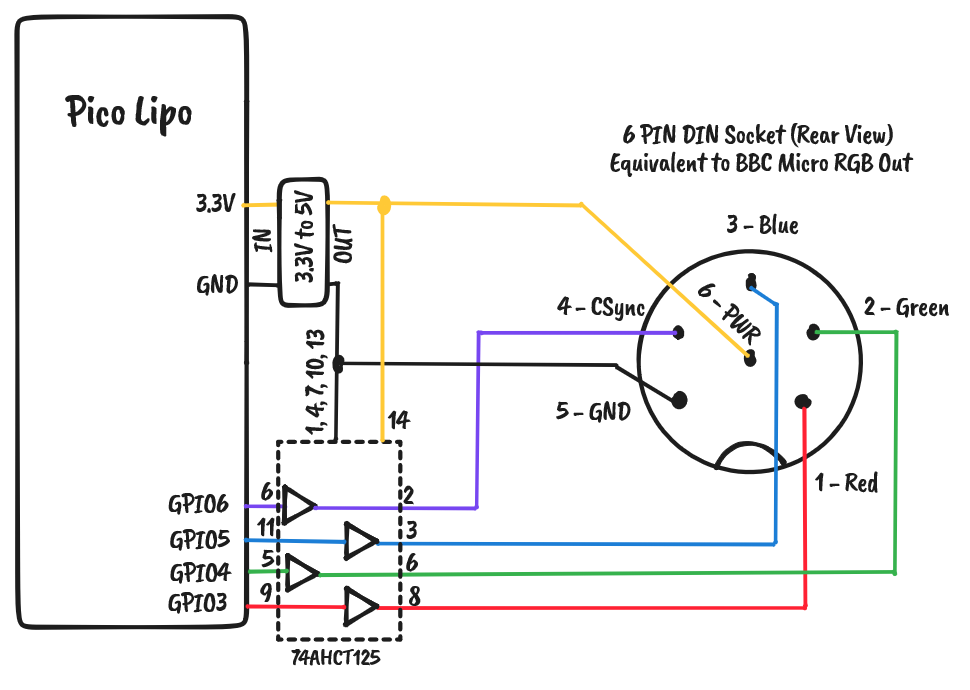
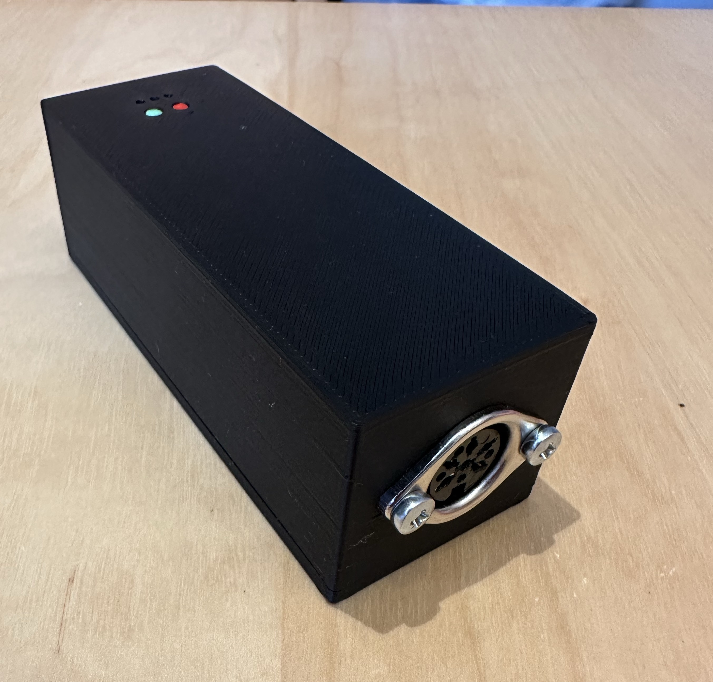
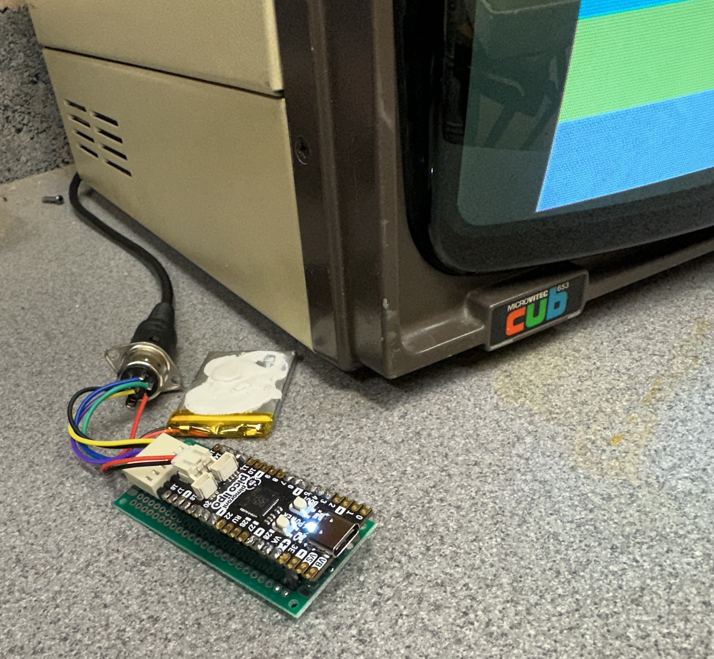

# pico-pattern

Pico-pattern is a video pattern generator based on the Raspberry Pi Pico for testing 8-bit era CRT monitors such as the Microvitec Cub. Pico-pattern uses the video generator from [pico-mposite](https://github.com/breakintoprogram/pico-mposite).

The main target of pico-pattern is to generate video with TTL-compatible R,G,B and Composite Sync at 50Hz as used by the BBC Micro.

Pico-pattern offers a range of typical video test patterns including:

- Colour Bars
- Pure White
- Line Grid
- Dot Grid
- Centre Cross Hairs


Sorry for the usual difficulties photographing CRTs in the picture!

## Software Build and Deployment

If you want to use the pre-built output then you can just download the file `build/pico-pattern.uf2` and skip to the last paragraph of this section. 

It is recommended to build on a Linux environment. I used Ubuntu under WSL2.

To build yourself follow these instructions:

Install the [Pi Pico C SDK](https://github.com/raspberrypi/pico-sdk) and all the necessary build tools.

Clone this repository to a sibling folder of the SDK. From a commend line cd into the pico-pattern directory and use the following commands (with appropriate change for your system):

```
cd build
cmake -DPICO_SDK_PATH=/path/to/pico-sdk ..
make
```

This should generate a file `build/pico-pattern.uf2`. 


Connect a Pi Pico to the computer while holding down the BOOTSEL button. Copy the `build/pico-pattern.uf2` file to the Pi Pico virtual drive.

## Hardware for Pimoroni Pico Lipo

My version is constructed using a Pimoroni Pico Lipo which creates a battery powered version with a minimum of external components. The schematic is below. In the Pico Lipo the "boot" button doubles as a user button to select the pattern to display.

Originally, I didn't include a 3.3V to 5V level shifter (74AHCT125) because I figured that 3.3V output would be high enough to work with TTL input monitors. This is true, but some monitors (e.g. the Mictovitec Cub) have pull-up resistors on the input going to 5V. **This isn't good for the 3.3V Pi and I fried a few outputs!** In the second version I added a 3.3V to 5V DC module and a 74AHCT125 used as a level shifter.



The second version is constructed on pad-board with a 3D printed case.

## Photos of the second version (with level shifter on daughter board)






## Photos of the first version (without level shifter)


## Hardware for Normal Pi Pico

Connect the DIN socket as shown for the Pico Lipo. If you have a 5V system bus then connect the 5V components to 5V rather than using a DC convertor.

For a normal Pi Pico you will need to add an external user button and change the software to enable a pull up for the user button in the file `main.h`.

You will need to choose a suitable power option. The easiest is just to power from the USB port via an external supply or a USB boost battery. The pattern generator draws about 20mA at 5V or 60mA at 3V so powering from 2 or 3 AA batteries would also be an option. See the Pi Pico Datasheet for information on how to attach an external power supply.


## Use 

Program the Pi Pico as described above. Construct the hardware and connect to a suitable monitor. Power On!

Short presses on the external button will advance through the different patterns. The LED on the Pi Pico will flash the number of the current pattern.

- 1 = Colour Bars Horizontal
- 2 = Colour Bars Vertical
- 3 = Solid Colour Screen
- 4 = Vertical Lines
- 5 = Horizontal Lines
- 6 = Grid
- 7 = Dots
- 8 = Centre Cross Hairs
- 9 = Chess Pattern
- 10 = Border and circle

Holding the external button will choose sub-options in the pattern. Normally this cycles through white, red, green, blue colours.


## Notes

Dean is very disparaging about Pico-mposite, but I think it works really well and demonstrates very nicely the power of the DMA and PIO state machines on the RP2040. Great work Dean! 

Currently the pattern generator only outputs RGB video. It could be adapted to use the existing work in Pico-mposite to output other video formats.

The video output from this device is not interlaced.
